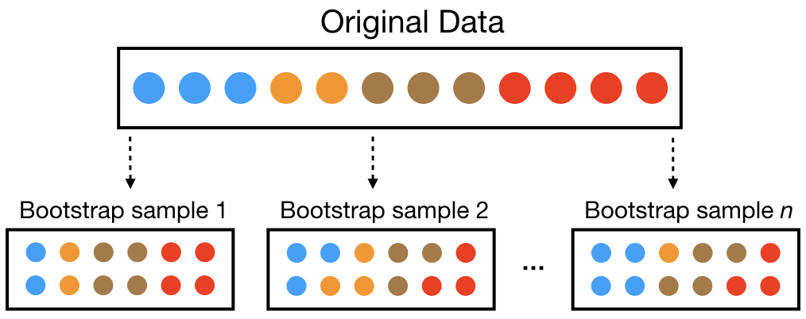

# Bootstrap Inference for Regression Coefficients

## Objective  
This notebook studies the **variability and uncertainty** of the slope coefficient $\beta_1$ in a **simple linear regression model** using **bootstrap resampling**.  
The goal is to estimate **confidence intervals** without relying on analytical assumptions, and to compare two main approaches:
- **Normal-approximation CI**
- **Percentile CI**

---
The bootstrap is a resampling method that estimates the sampling distribution of a statistic by repeatedly drawing samples with replacement from the observed data; it is more robust than the jackknife because it captures both bias and variance more accurately, especially in nonlinear estimators or small samples, where the jackknife’s leave-one-out approach tends to underestimate variability. 

## Mathematical Framework  
We consider the linear model:

    yᵢ = β₀ + β₁·xᵢ + εᵢ,   where  εᵢ ~ i.i.d.(0, σ²)

The OLS estimators are:

    β̂₁ = Σ[(xᵢ − x̄)(yᵢ − ȳ)] / Σ[(xᵢ − x̄)²]
    β̂₀ = ȳ − β̂₁·x̄

To assess the sampling variability of β̂₁, we apply the bootstrap principle:
1. Resample (xᵢ, yᵢ) pairs with replacement.  
2. Recompute β̂₁* for each bootstrap sample.  
3. Repeat B times (e.g. B = 2000) to approximate the sampling distribution of β̂₁.

---

## Inference  
From the empirical distribution of β̂₁*:

- Normal CI:  
  β̂₁ ± z₍₁₋ₐ/₂₎ · SE_boot

- Percentile CI:  
  empirical quantiles of β̂₁*.

These intervals provide **non-parametric inference** and capture possible **asymmetry or skewness** in the sampling distribution.

---

## Main Takeaway  
Bootstrap inference allows direct estimation of the **uncertainty of regression coefficients** without analytical variance formulas.  
It highlights the robustness of $\hat{\beta}_1$ and the shape of its empirical distribution.

